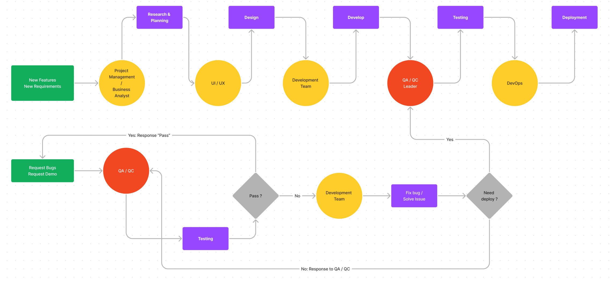
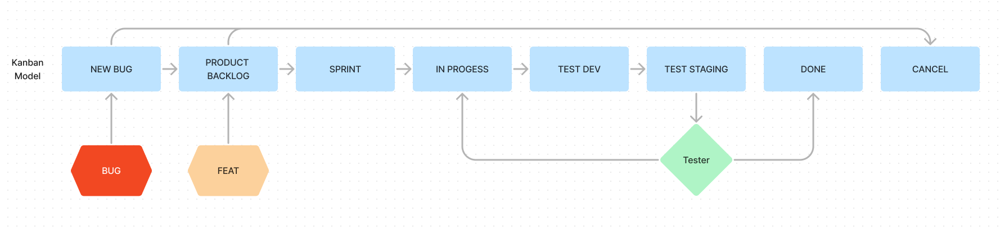

> Log bug cũng tuân theo quy trình scrum

Các dự án quản lý theo mô hình **Kanban**

### Cấu trúc quản lý dự án

- **NEW BUG:** Nơi các bug phát hiện được đưa vào quá trình sửa lỗi
- **PRODUCT BACKLOG:** Nới các bug, tính năng được lên kế hoạch
- **SPRINT:** Quá trình tuần hoàn kéo dài 2-4 tuần tùy dự án (đa phần là 2 tuần) nơi các bug, tính năng cần đuwocj hoàn tất trong chu trình
- **IN PROGESS:** Đánh dấu các bug, tính năng đang được sửa, phát triển
- **TEST DEV:** Đánh dấu bug, tính năng đã hoàn tất và đang kiểm thử trong môi trường dev (dev tự test)
- **TEST STAGING:** Đánh dấu bug, tính năng cần được test trên môi trường staging
- **DONE:** Bug, tính năng đã thông qua tất cả các bài test
- **CANCEL:** Bug, tính năng bị loại trừ do không phù hợp, ngoài yêu cầu...

### Quy chuẩn log bug

- `[Bug/Feat]` Mô tả lỗi ngắn gọn. Ví dụ: [Bug] Không thể đính kèm tập tin vào bình luận
- Có ngày thực hiện, ngày kết thúc có thể bỏ trống để cho scrum master tự điền sau
- Nội dung mô tả rõ ràng 2 thành phần:
  - Mô tả lỗi
  - Mong đợi
- Đính kèm các file nếu cần thiết
- Bug mới thêm ở nhóm công việc `NEW BUG`
- Tính năng thêm ở cột `PRODUCT BACKLOG`
- Gắn nhãn phù hợp (nếu có)

:::note
Đến giai đoạn dev thực thi sẽ gắn thêm nhánh code trên tiêu đề. Ví dụ: [FixUpload][Bug] Không thể đính kèm tập tin vào bình luận
:::

_Author: **Lê Thành Hiếu**_

