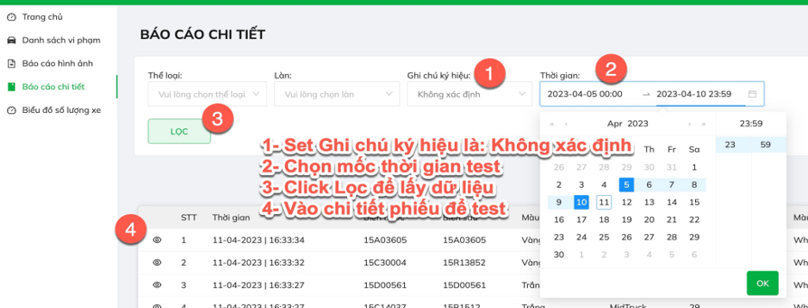
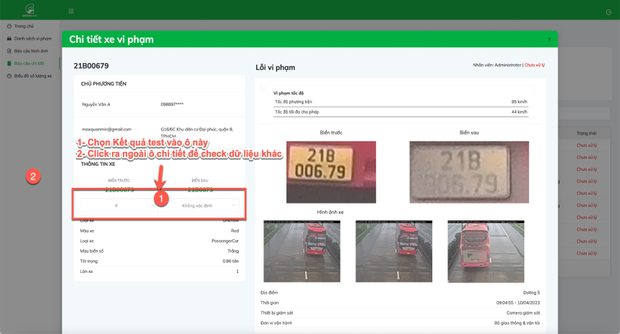
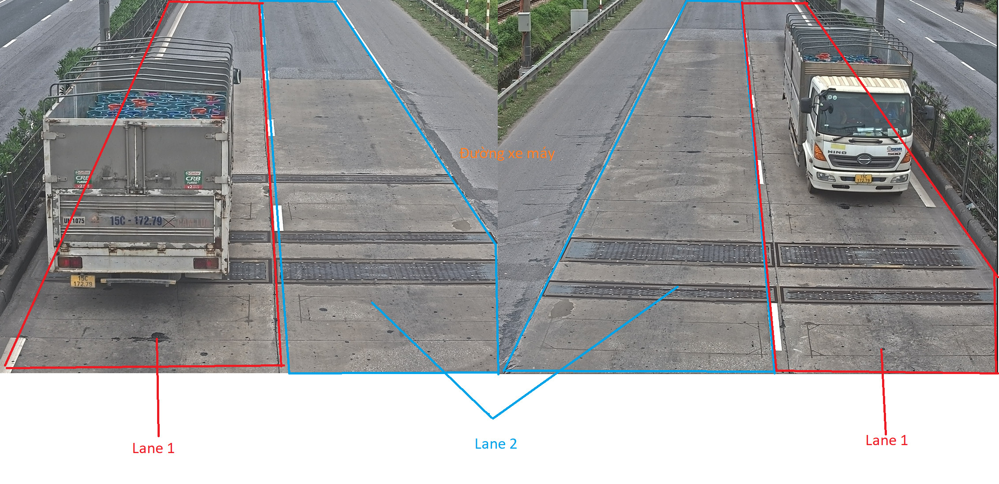

### Phân loại trên ứng dụng Takas

**Bước 1:** Truy cập phần mềm

> Truy cập phần mềm: [Green Traffic](https://app.greentraffic.vn/sign-in)  
> Thông tin đăng nhập: oryza | ------

**Bước 2:** Thực hiện theo hướng dẫn

Bảng phân loại lỗi Takas

| Ký hiệu | Mô tả                                                                                                                 |
| ------- | --------------------------------------------------------------------------------------------------------------------- |
| X       | Mắt thường nhìn thấy biển số, kết quả text trùng với hình ảnh biển số xe                                              |
| S       | Mắt thường nhìn thấy biển số, kết quả text **không** trùng với hình ảnh biển số xe                                    |
| B       | Biển số xe bị bẩn, hoặc bị dán băng đen, hoặc cắm hương... hoặc ảnh quá nhỏ mà mắt thường không nhận ra được          |
| T       | Biển quá tối, mắt thường không nhìn ra được                                                                           |
| C       | Biển bị chói (có thể do ánh sáng mặt trời, hoặc đèn xe ngay sát biển)                                                 |
| KG      | Ảnh chụp không nhìn thấy biển số, do xe quá gần camera (với viển trước, xe đi nhanh qua chỉ chụp được thân xe)        |
| KX      | Ảnh chụp không nhìn thấy biển số, do xe quá xa camera (với biển trước, xe đi quá chậm. Với biển sau, xe đi quá nhanh) |
| KHA     | Không có ảnh chụp                                                                                                     |

**Bước 3:**Sau khi phân loại biển xong thì lấy dữ liệu từ report

**Bước 4:**Lọc các kết quả KHA để tiến hành phân loại lần 2

### Phân loại lần 2 Oryza

Bảng phân loại lỗi Oryza

| Ký hiệu | Mô tả                                 |
| ------- | ------------------------------------- |
| KB      | Không biển                            |
| KHB     | Biển bị khuất, che 1/2                |
| BC      | Biển bị chói do gắn đèn công suất lớn |
| BX      | Biển xấu                              |
| K       | Khác: xe chạy ngoài lane...           |
| --      | Chưa xác định được nguyên nhân        |
| S       | Lỗi phía Oryza do cắt ảnh biển        |
| NC      | Không thể kiểm tra do lag, mất video  |

Chú thích khác

| Ký hiệu | Mô tả                                        |
| ------- | -------------------------------------------- |
| CQ      | Lỗi chủ quan thuộc Oryza (tương ứng -- và S) |
| KQ      | Lỗi khách quan                               |

#### Hướng dẫn test

**Bước 1:** Thêm 3 cột sau vào bảng data

- Link ảnh chụp từ Playback
- KQ Oryza
- Phân loại lỗi
- Note

**Bước 2:** Dựa theo thời gian trên sheet để tìm vfa chụp ảnh biển số phương tiện tương ứng biển trước và sau điền vào cột **Link ảnh chụp từ Playback**

Chú ý: Phân biệt lane 1 và 2 theo hướng dẫn sau:

**Bước 3:** Phân loại kết quả

- KQ Oryza: điền phân loại KB, KHB...
- Phân loại lỗi: điền KQ, hoặc CQ

**Bước 4:** Tổng hợp

_Author: **Lê Thành Hiếu**_

