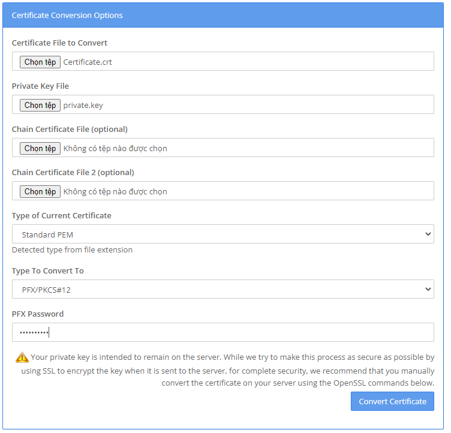
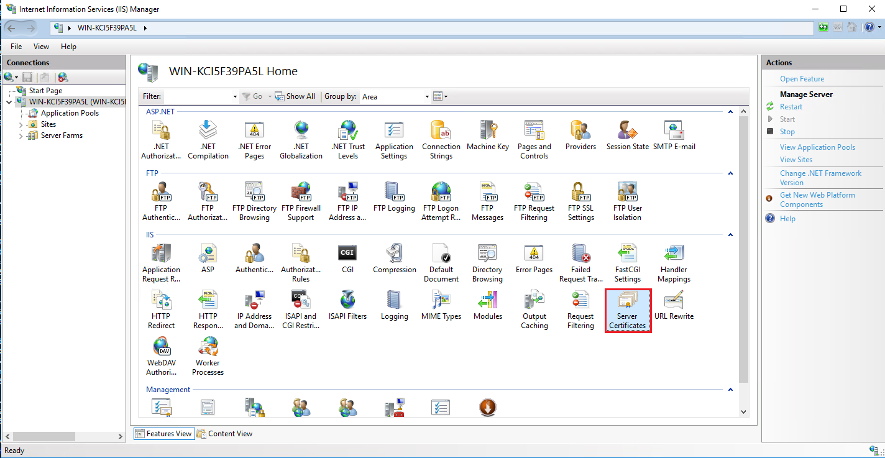
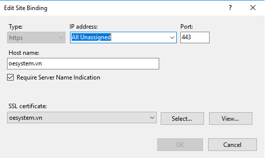
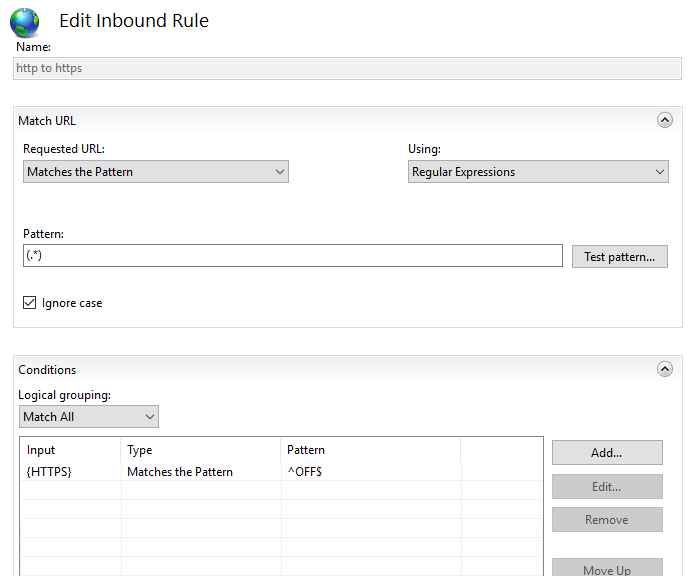
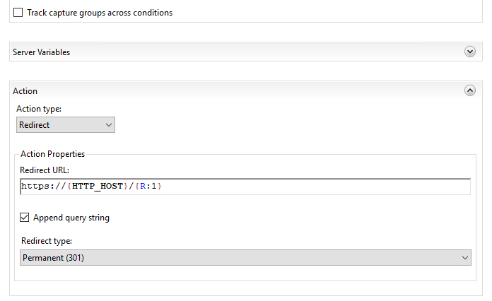

### Deploy ứng dụng web

Để build ứng dụng của bạn (cả frontend và backend) sử dụng lệnh sau:

```bash
npm run build --prod
```

Chạy thử ứng dụng ở chế độ product

```bash
npm run start
```

> Gõ trên trình duyệt `http://localhost:3000` cho frontend hoặc port do bạn cấu hình đối với backend để xem kết quả

### Đẩy source lên server

- Copy thư mục dist (backend), .next (front-end) lên server
- Copy các file nằm cùng cấp với thư mục đã chép ở bước trên (không copy các thư mục)
- Trên server. Gõ **`npm i`** để cài lại các gói thư viện cần thiết
- Chạy ứng dụng lên bằng lệnh **`npm run start`**
- Truy cập nội bộ xem kết quả

### Cài đặt IIS trên server

- Mở ứng dụng `Server Manager`
- Chọn `Add roles and features`
- Nhấn `Next` cho đến mục `Server Role` tích chọn `Web Server (IIS)`
- Cài đặt bình thường

### Tạo website trên IIS

Thực hiện xong các bước trên ứng dụng của bạn đã thành công ở bước chạy nội bộ. Để chạy trên môi trường internet bạn cần thực hiện thêm các bước sau

- Truy cập IIS trên server
- Tạo một website mới có binding là địa chỉ website của bạn (port 80 cho http. và 443 cho https)
- Cài Rewrite [tại đây][rewrite] nếu IIS của bạn chưa có

### Cài đặt SSL cho website chạy https

- Khi bạn nhân được email từ nhà cung cấp SSL. hãy chia chúng thành 2 file ứng với nội dung có tên như sau:

  - Certificate.crt
  - private.key

- Truy cập trang web để chuyển đổi các file trên thành tập tin IIS có thể hiểu được [tại đây][convert]
- Chọn cấu hình như bên dưới và nhấn CONVERT
  
- Chép file convert được lên thư mục bất kì trên server
- Trên IIS chọn ứng dụng Server Certificates
- Import file vừa chuyển đổi của bạn vào đây
  

### Cấu hình rewrite trỏ http => https

- Quay lại ứng dụng của bạn trên IIS
- Chọn Binding và cấu hình port 443 như bên dưới

  

- Chú ý chọn SSL certificate là SSL bạn vừa thêm được ở bước trên
- Cuối cùng. Tạo rewrite chuyển http thành https

```bash
(.*)
```

```bash
{HTTPS} ^OFF$
```

```bash
https://{HTTP_HOST}/{R:1}
```




### Cấu hình rewrite revert proxy

- Tạo rewrite `Reverse Proxy`
- Đặt giá trị trỏ đến port ứng dụng đang chạy

```bash
localhost:3002
```

Tận hưởng thành quả của bạn trên IP public. Chúc bạn thành công!

[rewrite]: https://www.iis.net/downloads/microsoft/url-rewrite
[convert]: https://www.sslshopper.com/ssl-converter.html
