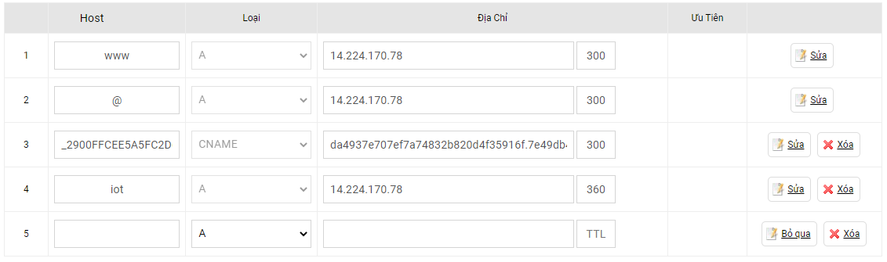

### Cách trỏ domain, chia subdomain

- Đăng nhập thông tin domain bạn đã được cung cấp [tại đây][pa]
  
  [pa]: https://access.pavietnam.vn/login.php

> **Chú ý**
>
> Record: `www` và `@` là mặc định. trỏ về địa chỉ ip của server  
> Thêm subdomain: tạo record loại `A`, host là tên subdomain. địa chỉ trỏ về server và lưu lại
