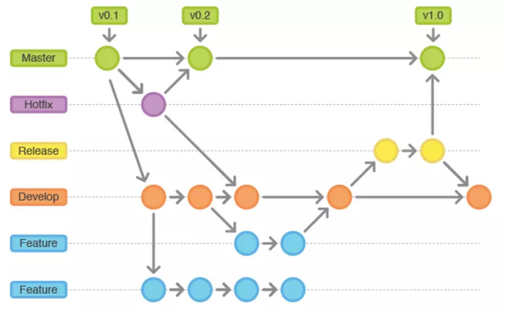

## Cách cài đặt

- Tạo tối thiểu 2 nhánh `dev` và `master`
- Chọn `Git-flow` trên thanh toolbar của source tree
- Chỉnh sửa các thông tin cần thiết (Chuyển development branch thành dev) và nhấn `OK`

## Giải thích

- **Master**: Master branchs có sẵn trong git và là branchs chứa mã nguồn khởi tạo của ứng dụng và các version đã sẵn sàng để realease cho người dùng có thể sử dụng. Thường cấu hình cho manage tương tác.
- **Hotfix**: Được base trên nhánh master để sửa nhanh những lỗi trên UIT hoặc sửa những cấu hình đặc biệt chỉ có trên môi trường productions.
- **Release**: Trước khi Release một phần mềm, release cần được tạo ra để kiểm tra lại lần cuối trước khi để người dùng có thể sử dụng (Thuông thường mã nguồn tại thời điểm này sẽ tạo ra bản build để test và kiểm tra lại bussiness).
- **Develop (dev)**: Được khởi tạo từ master branches để lưu lại tất cả lịch sử thay đổi của mã nguồn. Develop branchs là merge code của tất cả các branchs feature.
- **Feature**: Được base trên branchs Develop. Mỗi khi phát triển một feature mới chúng ta cần tạo một branchs để viết mã nguồn cho từng feature.

## Quy tắc

- Không thao tác bừa tránh việc làm hỏng source, conflict code
- Khi phát sinh tính năng mới bắt buộc phải tạo nhánh feature mới để tránh đụng code với các nhánh khác
- Push code bản thân lên nhánh cần tạo `Pull Request` để hợp nhất với `dev`
- Khi có bug trên nhánh `dev` thì tạo `feature`
- Khi có bug trên `master` thì tạo `hot fix`

_Author: **Lê Thành Hiếu**_

