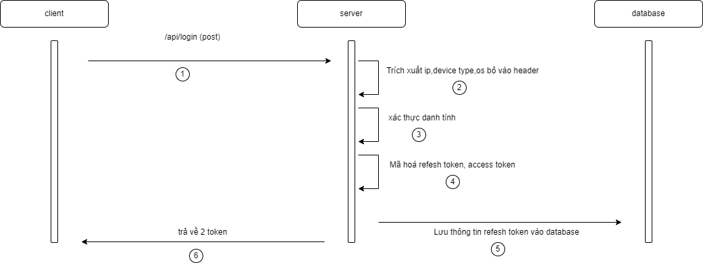
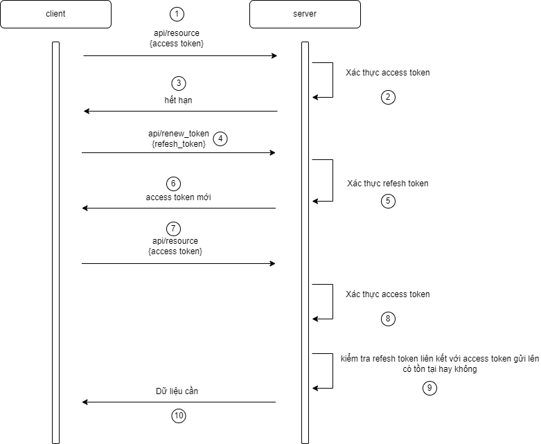
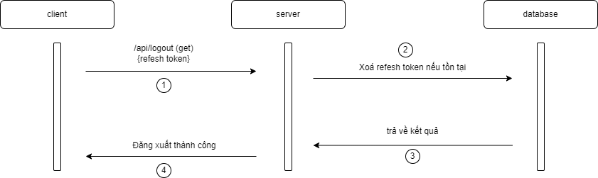

## Nội dung cơ bản

1. Refesh token

Chứa thông tin mà người dùng sử dụng để đăng nhập dược lưu ở cả hai phía người dùng cuối và database.

> Dữ liệu lưu ở database

| Tên          | Kiểu dữ liệu | Chú thích                              |
| ------------ | ------------ | -------------------------------------- |
| ID           | GenerateId   | Id phân biết                           |
| Os           | string       | loại hệ điều hành                      |
| Ip           | string       | địa chỉ ip                             |
| Device       | string       | Loại thiết bị (pc/mobile)              |
| Browser      | string       | loại trình duyệt                       |
| CreateByUser | string       | người tạo ra token                     |
| Expired      | string       | hết hạn của token                      |
| CreateAt     | string       | Thời gian mà người dùng cuối đăng nhập |

> Dữ liệu lưu ở client

| Tên           | Kiểu dữ liệu | Chú thích                     |
| ------------- | ------------ | ----------------------------- |
| refeshtokenID | string       | id của refesh token liên quan |

2. Access Token

Chứa thông tin cơ bản của người dùng và chỉ lưu ở phía người dùng.

| Tên           | Kiểu dữ liệu | Chú thích                         |
| ------------- | ------------ | --------------------------------- |
| createByUser  | string       | id người dùng tạo ra access token |
| expired       | number       | thời gian hết hạn                 |
| refeshtokenID | string       | id của refesh token liên quan     |

3. Mục tiêu

- Quản lý chặc chẽ việc đăng nhập của người dùng
- Bỏ qua việc người dùng đăng nhập nhiều lần khi access token mau hết hạn hoặc bảo mật kém khi access lâu hết hạn
- Có thể lưu lại những thông tin như: os, ip, browser, device

## Cách triển khai

1. Đăng nhập

**Các bước:**

- Người dùng gửi thông tin đăng nhập thông qua api post để xác thực
- Dựa vào header mà người dùng gửi lên để lấy các thông tin như ip, deivce, os, browser
- Xác thực người dùng thông qua dững liệu truyền lên
- Tạo ra ra refesh token và access token dựa trên 2 secrect key khác nhau
- Lưu những dữ liệu cần của refesh token vào database
- Trả về cho người dùng cuối 2 token vừa mã hoá

**Kết quả:**

- Người dùng nhận được cặp token refesh token, access token cho những lần thao tác nhau trên ứng dụng

2. Lúc lấy dữ liệu yêu cầu xác thực:

**Các bước:**

- Người dùng gọi api kèm theo access token
- Backend xác thực danh tính dựa trên access token nếu access token hết hạn hoặc không giải mã được sẽ trả về lỗi để yêu cầu backend cấp mới access token dựa trên refesh token
- Backend sẽ check xem refesh token liên quan có tồn tại hay không nếu refesh token hết hạn, không giải mã được hoặc không tồn tại sẽ trả về lỗi
- Nếu refesh token hết hạn hoặc không tồn tại sẽ đẩy sang login

**Mục tiêu:**

- Phía server có thể có thể biết dược bao nhiêu người dùng đăng nhập vào ứng dụng dựa trên các refesh token lưu ở database
- Xử lý lỗi trả về một cách tự động thuận tiện và dễ dàng

3. Tự mình đăng xuất

Bước thực hiện :

- Người dùng gửi yêu cầu đăng xuất kèm theo refesh token
- Backend server check end nếu tồn tại refesh token ấy dưới database thì xoá.

**Mục tiêu :**

- Nếu refesh token bị xoá sẽ vào thường hợp mục b phần 3 đăng nên sẽ giải quyết được việc cùng một trình duyệt mở 2 tab mà ở tab này mình đăng xuất rồi nhưng tab kia vẫn thao tác bình thường

4. Cưỡng chế đăng xuất

**Bước thực hiện:** giống mục b nhưng thay vì xoá 1 refesh refesh thì trường hợp này xoá nhiều refesh token

**Mục tiêu:**

- khi bị lộ refesh hoặc vừa mới thay đổi các thông tin được dùng cho việc đăng nhập(tài khoản, mật khẩu) thì người dùng cuối hoặc người quản trị có thể chủ động loại bỏ phiên đăng nhập mà mình nghi ngờ hoặc toàn bộ để dảm bảo an toàn.

_Author: **Nguyễn Hoàng Lâm**_

