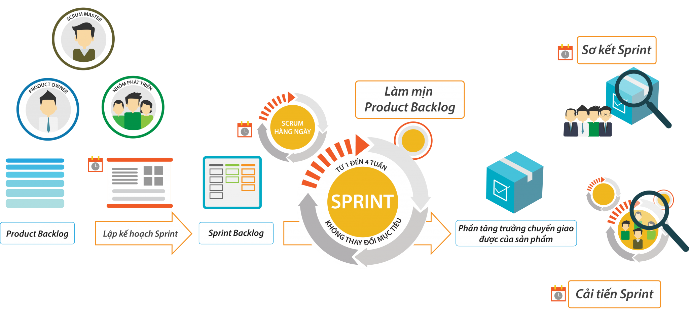

Scrum là một framework về quy trình và quản lý giúp giải quyết các vấn đề phức tạp, nhưng vẫn đảm bảo tính hiệu quả, sáng tạo và sản phẩm được tạo ra phải đạt được giá trị cao nhất. Nó khuyến khích các team học hỏi qua thực nghiệm, tự tổ chức khi giải quyết vấn đề, cũng như phản ánh những mặt đạt được và thiếu sót để từ đó từng bước phát triển.

### 5 giá trị cốt lõi của Scrum

- **Cam kết**: Mỗi thành viên cam kết với các thành viên khác về những điều mình làm & công việc đã được chọn ở buổi lập kế hoạch Sprint.
- **Tập trung**: Mọi người tập trung vào công việc của Sprint & Mục tiêu Sprint của Nhóm.
- **Cởi mở**: Mọi thứ cần được cởi mở để các thành viên trong team có thể nắm bắt được công việc cũng như hiểu hết các vấn đề khó khăn đang gặp phải.
- **Tôn trọng**: Các thành viên trong team cần phải tôn trọng lẫn nhau, giúp nhau trở nên tốt hơn và có thể độc lập hoàn thành công việc của mình. Thiếu đi sự tôn trọng các thành viên trong team không thể làm việc với nhau được.
- **Can đảm**: Thành viên trong team cần có sự can đảm để làm điều đúng đắn cũng như làm việc trong điều kiện khó khăn.

### Các vai trò trong quy trình

- **Developer team**: Development team ở đây không chỉ có kỹ sư phần mềm mà còn bao gồm tất cả mọi thành phần tham gia quá trình phát triển dự án, có thể là designers, programmers, writers,...
- **Product Owner**: Là người chịu trách nhiệm về thành công của dự án, người định nghĩa các yêu cầu và đánh giá cuối cùng đầu ra của bên phát triển phần mềm. Product Owner phải tiếp nhận tất cả yêu cầu và lập ra các trình tự công việc.
- **Scrum Master**: Là người có hiểu biết sâu sắc về Scrum. Scrum Master chịu trách nhiệm tổng hợp mọi thứ lại và đảm bảo team làm việc hiệu quả với Scrum.

### Các cuộc họp trong quy trình scrum

- **Sprint Planning:**  
  _Thời điểm_: bắt đầu của một sprint  
  _Thời lượng_: thường trong khoảng 1h đối với kick off sprint trong 1 tuần  
  _Mục tiêu_: Sprint planning là buổi họp chuẩn bị cho cả team để đem đến thành công xuyên suốt sprint. Đến với buổi họp, Product Owner sẽ có danh sách thứ tự ưu tiên công việc (product backlog) và cùng với đội ngũ phát triển thảo luận cũng như ước lượng thời gian cần thiết để hoàn thành các task đó.

- **Daily Stand-up:**  
  _Thời điểm_: Mỗi ngày một lần, thường vào buổi sáng bắt đầu ngày làm việc  
  _Thời lượng_: Không dài hơn 15 phút, chỉ cần đứng tại chỗ họp  
  _Mục tiêu_: Stand-up là buổi họp giúp mọi người nắm được điều gì đang xảy ra trong team. Mỗi thành viên phải trả lời các câu hỏi sau:

        Hôm qua đã làm được gì?
        Hôm nay sẽ làm gì?
        Có gì vướng mắc không?

- **Sprint Review:**  
  _Thời điểm_: Kết thúc một sprint  
  _Thời lượng_: 30-60 phút  
  _Mục tiêu_: rà soát lại công việc đã hoàn thành, lấy ý kiến đánh giá từ các bên liên quan, đề suất chỉnh sửa cũng như các thay đổi cần thiết cho sản phẩm.

- **Retrospective:**  
  _Thời điểm_: Kết thúc một chu kì  
  _Thời lượng_: 60 phút  
  _Mục tiêu_ : Giúp team hiểu được những việc đã đạt được và những việc chưa đạt được, từ đó tìm ra phương pháp cải tiến cũng như những kế hoạch, hành động phát triển.

_Author: **Lê Thành Hiếu**_

